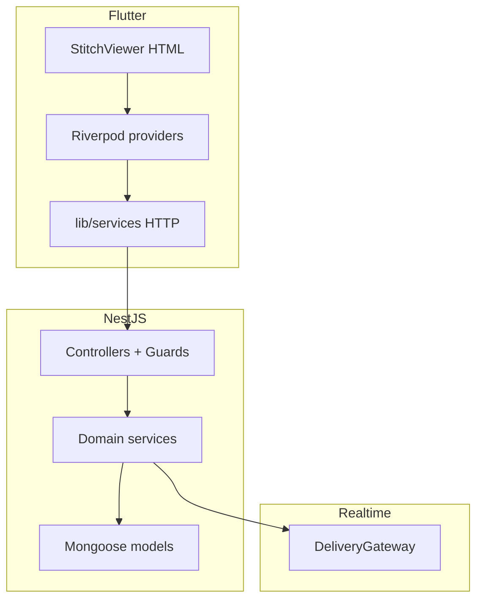

# Architecture (post-delivery)

## Overview

**Nassib** is a Flutter client + NestJS API for motorcycle delivery and related commerce. Data lives in **MongoDB** (Mongoose). **Socket.IO** namespace `/delivery` pushes delivery/driver events. **JWT** authenticates REST and WebSocket handshakes.

## Layers

## Security model (updated)

- **JwtAuthGuard** + **RolesGuard** + optional **`@Roles()`**. If `@Roles` is omitted, any authenticated user passes `RolesGuard`.
- **`@Public()`** (`src/common/decorators/public.decorator.ts`) skips JWT on specific handlers (e.g. `GET /faqs`).
- **Deliveries**: single-record reads and cost updates require customer, assigned driver, or admin; status updates require **assigned driver** only; cancel supports customer/driver/admin (admin bypass in service).
- **Drivers**: static routes registered before `:id`; mutations and reads use **admin-or-self-driver** checks in `DriversService`.
- **Orders**: customer-only for user order APIs; admin keeps status updates.
- **Documents**: `findOneForRequester` enforces owner or admin.
- **Firebase**: `send-push` is **admin-only**.

## Configuration

- **Production gate**: `validateProductionEnvironment()` requires strong `JWT_SECRET` and `MONGODB_URI`.
- **CORS**: `FRONTEND_ORIGINS` (+ dev defaults when not production).
- **WebSocket CORS**: `WEBSOCKET_CORS_ORIGINS` or reuse `FRONTEND_ORIGINS` in production (`socket-cors.util.ts`).

## Key files

| Concern | Location |
|---------|----------|
| App bootstrap | `backend/src/main.ts` |
| Modules | `backend/src/app.module.ts` |
| JWT / roles / public | `backend/src/auth/*`, `backend/src/common/decorators/public.decorator.ts` |
| Delivery authz | `backend/src/deliveries/deliveries.service.ts`, `deliveries.controller.ts` |
| Driver authz + routes | `backend/src/drivers/drivers.service.ts`, `drivers.controller.ts` |
| Realtime | `backend/src/websocket/delivery.gateway.ts` |
| Env template | `backend/.env.example` |

*Inferred:* Flutter `AppConfig.backendPort` must match deployed API `PORT` (see deployment checklist).
