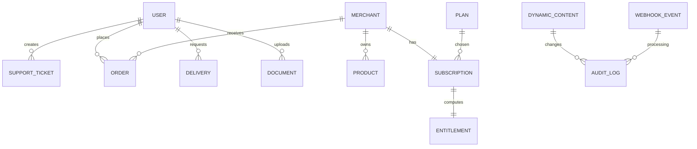

## Data model (v1 → paid-grade)

### Existing core entities (already in repo)
- **User**: `{ email, passwordHash, name, role: CUSTOMER|DRIVER|ADMIN, preferences, isVerified, region }`
- **Merchant**: `{ name, region, isActive }`
- **Category** / **Product**
- **Order** (customer orders) and/or **Delivery** (fulfillment lifecycle)
- **Driver** + **Documents** (verification)
- **SupportTicket**, **FAQ**, **Feedback**
- **Notification** (inbox)
- **PromoCode**, **SurgeRule**

---

## New entities (required for paid product)

### 1) Plan (admin-managed, display + canonical)
Represents a sellable plan definition.

Fields:
- `key` (string, unique): `merchant_basic`, `merchant_pro`
- `stripePriceId` (string, optional per environment)
- `name`, `description`, `features` (display)
- `limits` (canonical): e.g. `maxProducts`, `maxPromosPerMonth`, `analyticsLevel`
- `isActive`
- Audit: `createdBy`, `updatedBy`, timestamps

### 2) Subscription (source of truth from Stripe)
Fields:
- `ownerType`: `MERCHANT` (v1) (future: USER)
- `ownerId`: merchantId
- `stripeCustomerId`
- `stripeSubscriptionId`
- `status`: `trialing|active|past_due|canceled|incomplete|unpaid`
- `currentPeriodStart`, `currentPeriodEnd`
- `planKey` (denormalized)
- `cancelAtPeriodEnd` boolean
- Audit timestamps

### 3) Entitlement (computed effective access)
Fields:
- `ownerType`, `ownerId`
- `planKey`
- `features`: map `{ featureKey: boolean }`
- `limits`: map `{ limitKey: number }`
- `overrides`: optional admin overrides (time-bound)
- `computedAt`

### 4) WebhookEvent (idempotency + audit)
Fields:
- `provider`: `stripe`
- `eventId` (unique)
- `type`
- `payloadHash`
- `receivedAt`
- `processedAt`
- `status`: `received|processed|failed`
- `error` (sanitized)

### 5) DynamicContent / Settings (CMS-like)
Option A: single collection with typed documents.
- `key` unique (e.g. `pricing_table`, `home_announcement_banner`)
- `schemaVersion`
- `status`: `draft|published`
- `data` (validated JSON)
- `publishedAt`
- Audit: `updatedBy`

### 6) AuditLog (admin actions)
Fields:
- `actorUserId`
- `actorRole` / `actorAdminRole`
- `action` (string enum)
- `targetType`, `targetId`
- `diff` (safe subset)
- `ip`, `userAgent`
- `createdAt`

---

## Relationships

---

## Constraints + invariants
- Entitlements must be enforceable **server-side** and cannot be overridden by client.
- Webhooks must be **idempotent** by `eventId`.
- Dynamic content changes require **audit log entries**.

