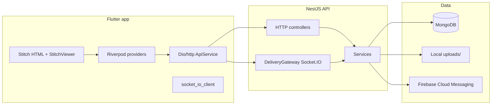
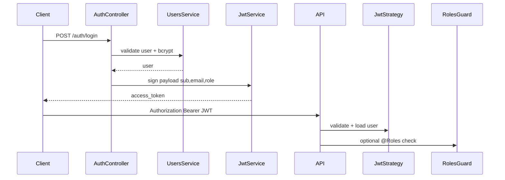

# Architecture — Nassib (ubermoto)

## Executive summary

The repository is a **monorepo** for a **motorcycle-based delivery / commerce platform** branded **Nassib** in code and Swagger, with a **Flutter** client (`frontend/`) and a **NestJS 10** API (`backend/`) backed by **MongoDB** (Mongoose). Real-time delivery updates use **Socket.IO** on namespace `/delivery`. The current Flutter shell primarily routes users through **HTML “Stitch” prototype screens** in a `WebView`-style viewer after auth, while Dart services and Riverpod providers implement partial API integration.

## Product purpose

- Enable **customers** to browse a **catalog**, place **orders**, request **deliveries**, apply **promo codes**, and manage profile/preferences.
- Enable **drivers** to manage availability, location, motorcycles, documents, payouts, and delivery lifecycle.
- Enable **admins** to verify drivers/documents, manage catalog, surge rules, support tickets, and view analytics-style endpoints.

*Source:* `backend/src` domain modules; `frontend/lib/main.dart` role-based home screens; `frontend/pubspec.yaml` description.

## Main user roles

| Role | Enum value | Typical capabilities |
|------|------------|----------------------|
| Customer | `CUSTOMER` | Orders, deliveries (create/cancel/tip/rate), catalog read, promo validation, recommendations |
| Driver | `DRIVER` | Accept/complete deliveries, documents, motorcycles, earnings, schedule, location |
| Admin | `ADMIN` | Catalog CRUD, surge rules, admin dashboard, document approval, user debug, order status |

*Source:* `backend/src/users/schemas/user.schema.ts` (`UserRole`).

## Functional scope (implemented in backend)

- **Auth**: register (customer/driver), login (email or phone + password), JWT issuance.
- **Users & addresses**: profile, password, preferences, favorites, saved addresses.
- **Catalog & orders**: categories/products (public reads; admin writes), orders CRUD-ish with reorder.
- **Deliveries**: create, list, driver pool, accept/start/complete/cancel, cost calculation, tips, ratings; WebSocket broadcasts.
- **Drivers & motorcycles**: profiles, verification (admin), earnings, payouts, schedule, leaderboard.
- **Documents**: multipart upload to disk + metadata in MongoDB.
- **Admin**: dashboard, pending drivers/documents, analytics stubs, reports.
- **Surge**: rules CRUD + preview; current surge for client.
- **Notifications**: FCM token registration; notification preferences; in-app notification inbox.
- **Promo codes**: validate/apply.
- **Support**: tickets, feedback, FAQs (all routes currently behind JWT — see assumptions).
- **Recommendations**: user recommendations + frequently-bought-together.
- **Firebase**: FCM registration + test send endpoint.
- **Health**: Mongo ping + system version.

## High-level architecture

## Frontend architecture

- **Framework**: Flutter 3.x, **Riverpod** for state (`ProviderScope` in `frontend/lib/main.dart`).
- **Localization**: `easy_localization` (en/ar).
- **Networking**: `http` via `frontend/lib/services/api_service.dart` with `AppConfig.baseUrl` (platform-specific host + port).
- **Secure storage**: `flutter_secure_storage` for tokens (`storage_service.dart`).
- **Maps / location**: `maplibre_gl`, `geolocator`, OSRM/Nominatim wrapper services.
- **Firebase**: Core, Analytics, Crashlytics, Messaging (initialized in `main.dart`).
- **UI pattern today**: `MaterialApp` `home: _AuthGate` loads **`StitchViewer`** HTML assets for splash, login, and role homes; named routes map stitch paths to the same viewer (`frontend/lib/main.dart`).
- **Feature modules**: Under `frontend/lib/features/` — auth, delivery, driver, products, motor_taxi, motorcycles, admin, settings (providers + a few screens). *Inferred:* many stitch screens are not yet wired to these services end-to-end.

## Backend architecture

- **Framework**: NestJS 10, modular boundaries under `backend/src/<domain>`.
- **Cross-cutting**:
  - `ConfigModule` global (`.env.local`, `.env`).
  - `ThrottlerModule` + global `ThrottlerGuard` (`app.module.ts`); `@SkipThrottle()` on health check.
  - `ValidationPipe` global: whitelist, forbid non-whitelisted, transform (`main.ts`).
  - `helmet`, CORS allowlist from `FRONTEND_ORIGINS` + dev defaults.
  - Sentry init (`sentry.config.ts`).
  - `MonitoringMiddleware` on `*` (`app.module.ts`).
- **Real-time**: `WebSocketModule` exports `DeliveryGateway` for delivery/driver events; injected into `DeliveriesService`, `DeliveryMatchingService`, `DriversService`.

## Database / data model overview

Mongoose schemas live beside domains, for example:

| Collection area | Schema files |
|-----------------|--------------|
| Users | `users/schemas/user.schema.ts`, `address.schema.ts` |
| Drivers | `drivers/schemas/driver.schema.ts`, `payout.schema.ts` |
| Deliveries | `deliveries/schemas/delivery.schema.ts` |
| Orders | `orders/schemas/order.schema.ts` |
| Catalog | `catalog/schemas/product.schema.ts`, `category.schema.ts`, `merchant.schema.ts` |
| Documents | `documents/schemas/document.schema.ts` |
| Surge | `surge/schemas/surge-rule.schema.ts` |
| Notifications | `notifications/schemas/notification.schema.ts`, `notification-preference.schema.ts` |
| Support | `support/schemas/support-ticket.schema.ts`, `faq.schema.ts`, `feedback.schema.ts` |
| Admin | `admin/schemas/admin-audit-log.schema.ts` |

*Needs verification:* exact Mongo collection names follow Mongoose defaults (pluralized/lowercased model names) unless overridden.

## Authentication / authorization flow

- **Mechanism**: Passport JWT (`ExtractJwt.fromAuthHeaderAsBearerToken`), secret from `JWT_SECRET`.
- **Payload** (`JwtPayload`): `sub`, `email`, `role` only (`auth.service.ts`). Full user (including `isVerified`) is loaded on each request in `validateUser` for HTTP guards.
- **Guards**: `JwtAuthGuard` + `RolesGuard` + `@Roles()` on many routes; `VerifiedDriverGuard` exists but is **not applied** on controllers in the reviewed tree.

## API structure

- **Base path**: No global `/api` prefix for REST; Swagger UI mounted at `/api` (`main.ts`).
- **Versioning**: None observed.
- **Documentation**: Swagger + `backend/UberMoto_API.postman_collection.json`.

## State management (frontend)

- **Riverpod** providers under `frontend/lib/features/*/providers/` and `frontend/lib/features/auth/providers/auth_provider.dart`.
- **Persistence**: token/user email via `StorageService`; Hive listed in `pubspec.yaml` for other local use (*verify* actual call sites).

## Third-party integrations

| Integration | Where |
|-------------|--------|
| MongoDB | Mongoose (`DatabaseConfigService`) |
| Firebase Admin | `FirebaseModule`, `firebase-admin` (backend + root `package.json`) |
| FCM | `firebase.controller.ts`, Flutter `firebase_messaging` |
| Sentry | Backend `@sentry/node` |
| OSRM / Nominatim | `frontend/lib/services/osrm_service.dart`, `nominatim_service.dart` |
| MapLibre | Flutter map rendering |

## File / module organization

- **Backend**: One folder per bounded context (`auth`, `users`, `deliveries`, …), each with `*.module.ts`, `*.service.ts`, `*.controller.ts`, `schemas/`, `dto/` where applicable.
- **Frontend**: `lib/core` (theme, utils, errors), `lib/services` (API clients), `lib/features` (UI state), `lib/models`, `lib/widgets`, `stitch/` (HTML prototypes).

## Deployment / runtime overview

- **Backend**: `npm run start:prod` → `node dist/main`; port from `PORT` or default scan comment in `main.ts` (defaults to first candidate).
- **Frontend**: Standard Flutter build for Android/iOS/macOS/web/windows/linux; see `frontend/DEPLOYMENT_README.md` (*not fully read in this pass*).
- **CI**: GitHub Actions run lint, tests, build for `backend/**` and `frontend/**` on `main`/`develop`.

## Security considerations

- Global throttling, helmet, validation pipe, CORS allowlist.
- **Risks**: default JWT secret; WebSocket CORS `*`; some endpoints lack `@Roles` narrowing; `POST /firebase/send-push` has JWT but no admin-only role check (*inferred* risk — any authenticated user could send test pushes if they know tokens).

## Performance considerations

- MongoDB as single data store; no Redis/queue observed in `app.module.ts`.
- File uploads written synchronously to disk in `documents.controller.ts`.
- Compression package present in `package.json` (*verify* if `compression` middleware is registered — not seen in `main.ts` during review).

## Technical debt / risks

- Naming drift: repo `ubermoto`, pubspec `ubertaxi_frontend`, backend package `nassib`.
- Stitch-first UI vs Dart-first product screens — integration depth uneven.
- Unused `VerifiedDriverGuard` vs driver verification fields on user.
- Authorization consistency on deliveries/documents (see `AUTH_AND_SECURITY.md`).

## Future scalability notes

- Extract file storage to object storage (S3-compatible) for multi-instance API servers.
- Introduce job queue for notifications/analytics.
- Tighten WebSocket authz (delivery room membership) beyond JWT connect.
- Add API versioning and environment-based OpenAPI publishing.
