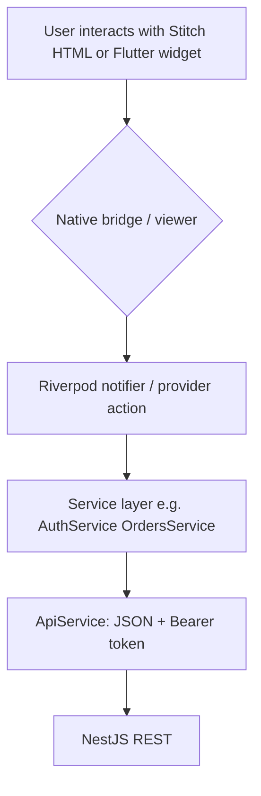
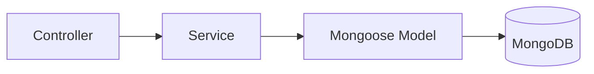

# Data flow

## User input flow (Flutter)

- **Auth**: Forms in Stitch or future Flutter screens → `AuthService.login/register*` → `POST /auth/*` → token stored via `StorageService` (`flutter_secure_storage`).
- **Subsequent calls**: `ApiService._getHeaders(requiresAuth: true)` attaches `Authorization: Bearer <token>`.

*Inferred:* Stitch HTML may not yet call Dart services for all actions; deep linking between WebView and providers **needs verification** per screen.

## Frontend → backend flow

| Step | Mechanism | Location |
|------|-----------|----------|
| Base URL resolution | `AppConfig.baseUrl` — Android emulator `10.0.2.2`, else `localhost` | `frontend/lib/config/app_config.dart` |
| HTTP | `http` package, retries/timeouts | `frontend/lib/services/api_service.dart`, `retry_helper.dart` |
| Errors | Mapped to `AppException` hierarchy | `frontend/lib/core/errors/app_exception.dart` |
| WebSocket | `socket_io_client` / `websocket_service.dart` | *Verify* parity with backend namespace `/delivery` and auth payload |

## Backend → database flow

- **Example — delivery create**: `DeliveriesController.create` → `DeliveriesService.create` → persists `Delivery` document → may call `DeliveryGateway.emitNewDelivery`.
- **Example — document upload**: `DocumentsController` writes **file to disk** then `DocumentsService.create` stores metadata referencing relative path.

## Async jobs / events

- **No BullMQ / scheduled task module** observed in `app.module.ts`.
- **Event-driven behavior** is primarily **synchronous service calls** + **Socket.IO emits** from services (`deliveries.service.ts`, `delivery-matching.service.ts`, `drivers.service.ts`).

## External API / data sources

| Direction | Integration | Notes |
|-----------|-------------|-------|
| Outbound (backend) | Firebase Admin | Push notifications (`firebase.service.ts`) |
| Outbound (frontend) | OSRM, Nominatim | Routing/geocoding for maps |
| Inbound | Client HTTP/WS | Throttled at edge via `ThrottlerGuard` |

## Admin / support flows

- Admin actions (verify driver, document status, ticket status) mutate MongoDB through services; **no separate audit trail usage verified** beyond `admin-audit-log.schema.ts` existence (*needs verification* whether writes go through that schema).

## Security-relevant data paths

- JWT never includes password; profile responses delete `password` in `UsersController.getProfile` / `updateProfile`.
- Uploaded documents: binary on server filesystem; path stored in DB — backup and PII policies are **operational concerns** not defined in code reviewed.
